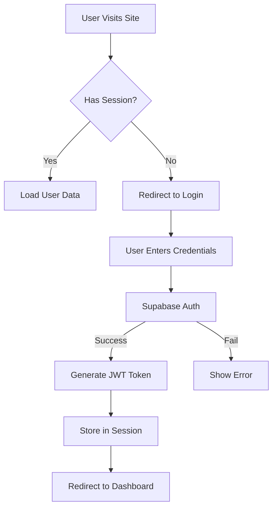
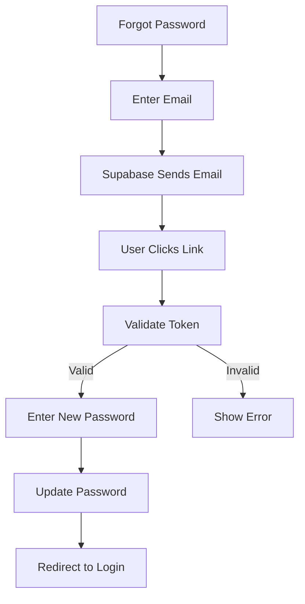

# Pukaarly Platform - Complete Project Documentation

## 📋 Table of Contents
1. [Project Overview](#project-overview)
2. [Technical Architecture](#technical-architecture)
3. [Features & Modules](#features--modules)
4. [Database Schema](#database-schema)
5. [Authentication & Authorization](#authentication--authorization)
6. [User Roles & Permissions](#user-roles--permissions)
7. [Reward & Economy System](#reward--economy-system)
8. [API Endpoints](#api-endpoints)
9. [Frontend Routes](#frontend-routes)
10. [Deployment Guide](#deployment-guide)
11. [Testing Strategy](#testing-strategy)
12. [Future Enhancements](#future-enhancements)

---

## 🎯 Project Overview

### **Project Name:** Pukaarly Platform
**Type:** Live Streaming & Social Engagement Platform with Multi-Role Management

### **Purpose:**
A comprehensive live streaming platform that connects Users, Anchors (Hosts), Agencies, and Admins in an ecosystem featuring:
- Live video streaming with PK battles
- Virtual gifting system
- Multi-level reward distribution
- Referral program
- Wallet & withdrawal management
- Agency partnerships

### **Target Users:**
- **Regular Users**: Watch streams, send gifts, earn rewards
- **Anchors (Hosts)**: Stream content, earn from gifts, level up
- **Agencies**: Manage multiple anchors, earn commissions
- **Admins**: Platform management, economy control, user moderation

---

## 🏗️ Technical Architecture

### **Tech Stack**

#### **Frontend:**
- **Framework:** Next.js 15.2 (Page Router)
- **Language:** TypeScript
- **Styling:** Tailwind CSS v3.4
- **UI Components:** shadcn/ui
- **State Management:** React Context API + Custom Hooks
- **Forms:** React Hook Form + Zod validation
- **Animations:** Framer Motion
- **Charts:** Recharts
- **Icons:** Lucide React
- **Date Handling:** date-fns

#### **Backend:**
- **Database:** PostgreSQL (via Supabase)
- **Auth:** Supabase Authentication (JWT-based)
- **Real-time:** Supabase Realtime subscriptions
- **Storage:** Supabase Storage (for avatars, images)
- **API:** Next.js API Routes (serverless)

#### **Infrastructure:**
- **Hosting:** Vercel (Frontend + Serverless Functions)
- **Database:** Supabase (PostgreSQL + Auth + Storage + Real-time)
- **CDN:** Vercel Edge Network
- **SSL:** Automatic HTTPS

### **Architecture Pattern:**
```
┌─────────────────────────────────────────────────┐
│            Next.js Frontend (Vercel)            │
│  ┌──────────┬──────────┬──────────┬──────────┐ │
│  │  User    │  Anchor  │  Agency  │  Admin   │ │
│  │Dashboard │Dashboard │Dashboard │Dashboard │ │
│  └──────────┴──────────┴──────────┴──────────┘ │
└─────────────────┬───────────────────────────────┘
                  │ API Calls
                  ▼
┌─────────────────────────────────────────────────┐
│         Supabase Backend Services               │
│  ┌──────────┬──────────┬──────────┬──────────┐ │
│  │PostgreSQL│   Auth   │ Storage  │Real-time │ │
│  │ Database │   JWT    │  Files   │  Events  │ │
│  └──────────┴──────────┴──────────┴──────────┘ │
└─────────────────────────────────────────────────┘
```

---

## 🎨 Features & Modules

### **1. Authentication System**
- ✅ Email/Password registration
- ✅ Email verification
- ✅ Login with JWT tokens
- ✅ Forgot password flow
- ✅ Password reset with email link
- ✅ Role-based access control (RBAC)
- ✅ Session management
- ✅ Auto-logout on token expiration

### **2. User Management**
- ✅ User profiles with avatars
- ✅ Profile editing (name, bio, social links)
- ✅ Image cropping for avatars
- ✅ Privacy settings
- ✅ Notification preferences
- ✅ Account verification badges
- ✅ User levels & experience points

### **3. Wallet System**
- ✅ **Coins Balance**: Virtual currency for purchasing gifts
- ✅ **Beans Balance**: Earnings from received gifts (Anchors)
- ✅ **Reward Tokens**: Platform reward currency
- ✅ Transaction history with filtering
- ✅ Real-time balance updates
- ✅ Withdrawal requests

### **4. Gifting System**
- ✅ Virtual gift catalog with categories
- ✅ Gift animations
- ✅ Gift pricing in coins
- ✅ Send gifts during live streams
- ✅ Gift history tracking
- ✅ Combo gifts with multipliers

### **5. Live Streaming**
- ✅ Go live functionality for anchors
- ✅ Stream viewer interface
- ✅ Real-time chat
- ✅ PK (Player Kill) battles between anchors
- ✅ Live gift sending
- ✅ Viewer count tracking
- ✅ Stream quality settings

### **6. PK Battle System**
- ✅ Challenge system between anchors
- ✅ Real-time score tracking
- ✅ Battle timer (3 minutes)
- ✅ Gift contribution to battle score
- ✅ Winner announcement
- ✅ Battle history

### **7. Reward & Distribution System**
**On Every Gift Purchase:**
```
Total: 100 USDT equivalent
├── Admin: 10% (10 USDT)
├── Anchor: 50% (50 USDT)
├── Agency: 10% (10 USDT)
├── User: 20% (20 USDT)
└── Referral Pool: 10% (10 USDT)
```

**Token Minting:**
- 40 reward tokens minted per 1 USDT spent
- Tokens distributed according to percentages above

### **8. Referral System**
- ✅ Direct referral: 5% of referee's spending
- ✅ Multi-level referrals: 5% across 10 levels
- ✅ Referral code generation
- ✅ Referral tracking dashboard
- ✅ Referral earnings history
- ✅ Referral link sharing

### **9. Withdrawal System**
- ✅ User token withdrawal requests
- ✅ Anchor beans withdrawal requests
- ✅ Agency commission withdrawal requests
- ✅ Admin approval workflow
- ✅ Withdrawal history
- ✅ Status tracking (Pending/Approved/Rejected)
- ✅ Minimum withdrawal amounts

### **10. Agency System**
- ✅ Agency dashboard
- ✅ Anchor management
- ✅ Commission tracking
- ✅ Invite system for anchors
- ✅ Performance metrics
- ✅ Withdrawal management

### **11. Admin Panel**
- ✅ User management (view, edit, suspend, delete)
- ✅ Anchor management
- ✅ Agency management
- ✅ Gift catalog management
- ✅ Withdrawal approval system
- ✅ Platform economy overview
- ✅ Treasury management
- ✅ System settings
- ✅ Activity logs
- ✅ Analytics & reports

### **12. Messaging System**
- ✅ Private messaging between users
- ✅ Real-time message delivery
- ✅ Message history
- ✅ Unread message indicators
- ✅ User search
- ✅ Message notifications

### **13. Notification System**
- ✅ In-app notifications
- ✅ Real-time notification bell
- ✅ Notification categories (gifts, messages, system)
- ✅ Mark as read/unread
- ✅ Notification preferences
- ✅ Notification history

---

## 🗄️ Database Schema

### **Core Tables:**

#### **1. profiles**
```sql
- id (uuid, primary key)
- email (text, unique)
- full_name (text)
- username (text, unique)
- avatar_url (text)
- bio (text)
- role (enum: 'user', 'anchor', 'agency', 'admin')
- level (integer, default: 1)
- experience_points (integer, default: 0)
- is_verified (boolean, default: false)
- is_online (boolean, default: false)
- last_seen (timestamp)
- created_at (timestamp)
- updated_at (timestamp)
```

#### **2. wallets**
```sql
- id (uuid, primary key)
- user_id (uuid, foreign key → profiles.id)
- coins_balance (numeric, default: 0)
- beans_balance (numeric, default: 0)
- reward_tokens_balance (numeric, default: 0)
- total_spent (numeric, default: 0)
- total_earned (numeric, default: 0)
- created_at (timestamp)
- updated_at (timestamp)
```

#### **3. transactions**
```sql
- id (uuid, primary key)
- user_id (uuid, foreign key → profiles.id)
- type (enum: 'deposit', 'withdrawal', 'gift_sent', 'gift_received', 'reward', 'referral')
- amount (numeric)
- currency (enum: 'coins', 'beans', 'tokens')
- description (text)
- status (enum: 'pending', 'completed', 'failed', 'cancelled')
- metadata (jsonb)
- created_at (timestamp)
```

#### **4. gifts**
```sql
- id (uuid, primary key)
- name (text)
- description (text)
- image_url (text)
- price_coins (numeric)
- category (enum: 'basic', 'premium', 'luxury', 'special')
- animation_url (text)
- is_active (boolean, default: true)
- created_at (timestamp)
```

#### **5. gift_transactions**
```sql
- id (uuid, primary key)
- sender_id (uuid, foreign key → profiles.id)
- receiver_id (uuid, foreign key → profiles.id)
- gift_id (uuid, foreign key → gifts.id)
- quantity (integer)
- total_cost (numeric)
- stream_id (uuid, nullable)
- created_at (timestamp)
```

#### **6. referrals**
```sql
- id (uuid, primary key)
- referrer_id (uuid, foreign key → profiles.id)
- referee_id (uuid, foreign key → profiles.id)
- referral_code (text, unique)
- level (integer, 1-10)
- total_earned (numeric, default: 0)
- status (enum: 'active', 'inactive')
- created_at (timestamp)
```

#### **7. withdrawals**
```sql
- id (uuid, primary key)
- user_id (uuid, foreign key → profiles.id)
- amount (numeric)
- currency (enum: 'beans', 'tokens')
- payment_method (text)
- payment_details (jsonb)
- status (enum: 'pending', 'approved', 'rejected', 'completed')
- admin_notes (text)
- requested_at (timestamp)
- processed_at (timestamp)
```

#### **8. streams**
```sql
- id (uuid, primary key)
- anchor_id (uuid, foreign key → profiles.id)
- title (text)
- description (text)
- thumbnail_url (text)
- stream_key (text)
- status (enum: 'live', 'ended', 'scheduled')
- viewer_count (integer, default: 0)
- total_gifts_received (numeric, default: 0)
- started_at (timestamp)
- ended_at (timestamp)
- created_at (timestamp)
```

#### **9. pk_battles**
```sql
- id (uuid, primary key)
- anchor1_id (uuid, foreign key → profiles.id)
- anchor2_id (uuid, foreign key → profiles.id)
- anchor1_score (numeric, default: 0)
- anchor2_score (numeric, default: 0)
- winner_id (uuid, nullable)
- status (enum: 'pending', 'active', 'completed')
- duration_seconds (integer, default: 180)
- started_at (timestamp)
- ended_at (timestamp)
- created_at (timestamp)
```

#### **10. messages**
```sql
- id (uuid, primary key)
- sender_id (uuid, foreign key → profiles.id)
- receiver_id (uuid, foreign key → profiles.id)
- content (text)
- is_read (boolean, default: false)
- created_at (timestamp)
```

#### **11. notifications**
```sql
- id (uuid, primary key)
- user_id (uuid, foreign key → profiles.id)
- type (enum: 'gift', 'message', 'system', 'stream', 'withdrawal')
- title (text)
- message (text)
- link (text)
- is_read (boolean, default: false)
- created_at (timestamp)
```

#### **12. agencies**
```sql
- id (uuid, primary key)
- owner_id (uuid, foreign key → profiles.id)
- name (text)
- description (text)
- logo_url (text)
- commission_rate (numeric, default: 10)
- total_anchors (integer, default: 0)
- total_commission_earned (numeric, default: 0)
- status (enum: 'active', 'suspended')
- created_at (timestamp)
```

#### **13. agency_anchors**
```sql
- id (uuid, primary key)
- agency_id (uuid, foreign key → agencies.id)
- anchor_id (uuid, foreign key → profiles.id)
- joined_at (timestamp)
- status (enum: 'active', 'inactive')
```

#### **14. treasury_logs**
```sql
- id (uuid, primary key)
- admin_id (uuid, foreign key → profiles.id)
- action_type (enum: 'usdt_converted', 'profit_logged', 'liquidity_added')
- amount (numeric)
- notes (text)
- created_at (timestamp)
```

---

## 🔐 Authentication & Authorization

### **Authentication Flow:**



### **Role-Based Access Control (RBAC):**

```typescript
// Middleware checks in useAuth hook
const { user, isAdmin, isAnchor, isAgency } = useAuth();

// Route protection
if (!user) redirect('/auth/login');
if (!isAdmin) redirect('/user/dashboard');
```

### **Password Reset Flow:**



---

## 👥 User Roles & Permissions

### **1. User (Regular User)**
**Can:**
- ✅ Watch live streams
- ✅ Send gifts to anchors
- ✅ Chat in streams
- ✅ Manage wallet
- ✅ Earn reward tokens
- ✅ Refer friends
- ✅ Request withdrawals
- ✅ Update profile

**Cannot:**
- ❌ Go live
- ❌ Access anchor/agency/admin panels
- ❌ Approve withdrawals
- ❌ Manage other users

### **2. Anchor (Host/Streamer)**
**Can:**
- ✅ All User permissions
- ✅ Go live and stream
- ✅ Participate in PK battles
- ✅ Earn beans from gifts
- ✅ Set call prices
- ✅ View income analytics
- ✅ Level up system

**Cannot:**
- ❌ Access agency/admin panels
- ❌ Manage other anchors
- ❌ Approve withdrawals

### **3. Agency**
**Can:**
- ✅ Manage multiple anchors
- ✅ Invite anchors to join
- ✅ View commission earnings
- ✅ Track anchor performance
- ✅ Request withdrawals
- ✅ View analytics

**Cannot:**
- ❌ Go live (unless also an anchor)
- ❌ Access admin panel
- ❌ Approve withdrawals
- ❌ Manage platform settings

### **4. Admin**
**Can:**
- ✅ Full platform access
- ✅ Manage all users
- ✅ Approve/reject withdrawals
- ✅ Manage gifts catalog
- ✅ View all analytics
- ✅ Manage agencies
- ✅ System settings
- ✅ Treasury management
- ✅ View activity logs
- ✅ Suspend/delete accounts

---

## 💰 Reward & Economy System

### **Distribution Model:**

**Example: User sends a $100 gift**

```
Total Gift Value: $100
├── 1. Minting Tokens: 40 tokens/USD × $100 = 4,000 tokens
│
├── 2. Distribution:
│   ├── Admin (10%):     $10  → 400 tokens
│   ├── Anchor (50%):    $50  → 2,000 tokens (as beans)
│   ├── Agency (10%):    $10  → 400 tokens
│   ├── User (20%):      $20  → 800 tokens
│   └── Referral (10%):  $10  → 400 tokens (split across 10 levels)
│
└── 3. Referral Split (10 levels):
    ├── Level 1: 1% of total → $1  → 40 tokens
    ├── Level 2: 1% of total → $1  → 40 tokens
    ├── Level 3: 1% of total → $1  → 40 tokens
    └── ... (10 levels total)
```

### **Token Types:**

1. **Coins** (Purchase Currency)
   - Used to buy gifts
   - Purchased with real money
   - 1 Coin = 1 USD equivalent

2. **Beans** (Anchor Earnings)
   - Earned by anchors from gifts
   - Can be withdrawn as cash
   - 50% of gift value goes to beans

3. **Reward Tokens** (Platform Reward)
   - Earned by all participants
   - Can be withdrawn or used
   - 40 tokens per 1 USD spent

### **Withdrawal Rules:**

```typescript
// Minimum withdrawal amounts
const MINIMUMS = {
  beans: 50,      // $50 minimum
  tokens: 1000    // 1000 tokens minimum
};

// Processing time
- Beans withdrawal: 1-3 business days
- Token withdrawal: 3-7 business days
```

---

## 🔌 API Endpoints

### **Authentication:**
```
POST   /api/auth/register      - Register new user
POST   /api/auth/login         - Login user
GET    /api/auth/me            - Get current user
POST   /api/auth/forgot        - Request password reset
POST   /api/auth/reset         - Reset password
POST   /api/auth/logout        - Logout user
```

### **Users:**
```
GET    /api/users              - List users (admin)
GET    /api/users/:id          - Get user details
PUT    /api/users/:id          - Update user
DELETE /api/users/:id          - Delete user (admin)
```

### **Wallet:**
```
GET    /api/wallet             - Get wallet balance
POST   /api/wallet/deposit     - Deposit coins
GET    /api/wallet/transactions - Get transaction history
```

### **Gifts:**
```
GET    /api/gifts              - List all gifts
GET    /api/gifts/:id          - Get gift details
POST   /api/gifts/send         - Send gift
GET    /api/gifts/history      - Gift history
```

### **Streams:**
```
POST   /api/streams/start      - Start stream
POST   /api/streams/end        - End stream
GET    /api/streams/:id        - Get stream details
GET    /api/streams/live       - List live streams
```

### **PK Battles:**
```
POST   /api/pk/challenge       - Challenge another anchor
POST   /api/pk/accept          - Accept challenge
POST   /api/pk/contribute      - Contribute to battle
GET    /api/pk/:id             - Get battle status
```

### **Withdrawals:**
```
POST   /api/withdrawals        - Request withdrawal
GET    /api/withdrawals        - List withdrawals
PUT    /api/withdrawals/:id    - Update status (admin)
```

### **Messages:**
```
GET    /api/messages           - List conversations
POST   /api/messages           - Send message
GET    /api/messages/:id       - Get conversation
PUT    /api/messages/:id/read  - Mark as read
```

### **Notifications:**
```
GET    /api/notifications      - List notifications
PUT    /api/notifications/:id  - Mark as read
DELETE /api/notifications/:id  - Delete notification
```

### **Admin:**
```
GET    /api/admin/stats        - Platform statistics
GET    /api/admin/logs         - Activity logs
POST   /api/admin/treasury     - Log treasury action
```

---

## 🗺️ Frontend Routes

### **Public Routes:**
```
/                    - Landing page
/auth/login          - Login page
/auth/register       - Registration page
/auth/forgot-password - Forgot password
/auth/reset-password - Reset password
/auth/confirm-email  - Email confirmation
```

### **User Routes:**
```
/user/dashboard      - User dashboard
/user/explore        - Explore streams
/user/messages       - Private messages
/user/wallet         - Wallet management
/user/profile        - Profile settings
/user/referrals      - Referral dashboard
/user/withdraw       - Withdrawal requests
/user/live-stream-viewer - Watch live stream
```

### **Anchor Routes:**
```
/anchor/dashboard    - Anchor dashboard
/anchor/income       - Income analytics
/anchor/call-price   - Set call pricing
/anchor/level        - Level & progression
/anchor/withdraw     - Withdrawal management
/anchor/go-live      - Start streaming
/anchor/profile      - Anchor profile settings
```

### **Agency Routes:**
```
/agency/dashboard    - Agency dashboard
/agency/anchors      - Manage anchors
/agency/commission   - Commission tracking
/agency/withdrawals  - Withdrawal management
/agency/invite       - Invite anchors
/agency/profile      - Agency profile settings
```

### **Admin Routes:**
```
/admin/dashboard     - Admin dashboard
/admin/users         - User management
/admin/anchors       - Anchor management
/admin/agencies      - Agency management
/admin/economy       - Economy overview
/admin/gifts         - Gift catalog management
/admin/withdrawals   - Approval system
/admin/treasury      - Treasury management
/admin/settings      - Platform settings
/admin/logs          - Activity logs
/admin/user/[id]     - User detail view
/admin/profile       - Admin profile
```

---

## 🚀 Deployment Guide

### **Prerequisites:**
1. **Supabase Account** - Create project at supabase.com
2. **Vercel Account** - Sign up at vercel.com
3. **Domain** (optional) - For custom domain
4. **Email Service** - For transactional emails

### **Step 1: Supabase Setup**

```bash
# 1. Create new project on Supabase
# 2. Copy Project URL and Anon Key
# 3. Add to .env.local:

NEXT_PUBLIC_SUPABASE_URL=your_project_url
NEXT_PUBLIC_SUPABASE_ANON_KEY=your_anon_key
```

### **Step 2: Database Migration**

```sql
-- Run all migration files in order from:
supabase/migrations/

-- Or use Supabase CLI:
supabase db push
```

### **Step 3: Environment Variables**

Create `.env.local`:
```env
NEXT_PUBLIC_SUPABASE_URL=your_supabase_url
NEXT_PUBLIC_SUPABASE_ANON_KEY=your_anon_key
NEXT_PUBLIC_APP_URL=https://yourdomain.com
```

### **Step 4: Deploy to Vercel**

```bash
# Install Vercel CLI
npm i -g vercel

# Deploy
vercel

# Add environment variables in Vercel dashboard
# Settings → Environment Variables
```

### **Step 5: Configure Email Templates**

In Supabase Dashboard:
1. Go to **Authentication** → **Email Templates**
2. Customize:
   - Confirm signup
   - Reset password
   - Magic link
   - Email change

### **Step 6: Set Up Storage Buckets**

```sql
-- Create storage buckets
INSERT INTO storage.buckets (id, name, public) 
VALUES 
  ('avatars', 'avatars', true),
  ('gifts', 'gifts', true),
  ('streams', 'streams', true);

-- Set up storage policies
CREATE POLICY "Avatar images are publicly accessible"
ON storage.objects FOR SELECT
USING (bucket_id = 'avatars');
```

### **Step 7: Configure CORS**

In Supabase Dashboard:
1. Go to **Settings** → **API**
2. Add your domain to allowed origins

### **Step 8: Set Up Cron Jobs (Optional)**

For automated tasks:
```sql
-- Example: Clean up old notifications
CREATE EXTENSION IF NOT EXISTS pg_cron;

SELECT cron.schedule(
  'delete-old-notifications',
  '0 0 * * *', -- Daily at midnight
  $$DELETE FROM notifications 
    WHERE created_at < NOW() - INTERVAL '30 days'$$
);
```

---

## 🧪 Testing Strategy

### **Unit Tests:**
```typescript
// Example: Test wallet service
import { walletService } from '@/services/walletService';

describe('Wallet Service', () => {
  test('should fetch user balance', async () => {
    const balance = await walletService.getBalance(userId);
    expect(balance).toHaveProperty('coins');
    expect(balance).toHaveProperty('beans');
    expect(balance).toHaveProperty('tokens');
  });
});
```

### **Integration Tests:**
```typescript
// Example: Test gift transaction flow
describe('Gift Transaction Flow', () => {
  test('should complete gift transaction', async () => {
    // 1. Send gift
    const result = await giftService.sendGift({
      senderId,
      receiverId,
      giftId,
      quantity: 1
    });
    
    // 2. Check sender balance decreased
    const senderWallet = await walletService.getBalance(senderId);
    expect(senderWallet.coins).toBeLessThan(initialBalance);
    
    // 3. Check receiver beans increased
    const receiverWallet = await walletService.getBalance(receiverId);
    expect(receiverWallet.beans).toBeGreaterThan(0);
  });
});
```

### **E2E Tests:**
```typescript
// Example: Test complete user registration flow
import { test, expect } from '@playwright/test';

test('User registration flow', async ({ page }) => {
  await page.goto('/auth/register');
  await page.fill('[name="email"]', 'test@example.com');
  await page.fill('[name="password"]', 'Test123456!');
  await page.click('button[type="submit"]');
  await expect(page).toHaveURL('/auth/confirm-email');
});
```

---

## 🔮 Future Enhancements

### **Phase 2 Features:**
- [ ] **Video Recording**: Record streams for replay
- [ ] **Subscription System**: Monthly subscriptions for exclusive content
- [ ] **NFT Integration**: Convert rare gifts to NFTs
- [ ] **Mobile Apps**: iOS and Android native apps
- [ ] **AI Moderation**: Automated content moderation
- [ ] **Multi-language**: Support for 10+ languages
- [ ] **Payment Gateway**: Integrate Stripe/PayPal for deposits
- [ ] **Social Features**: Follow/unfollow, feed, stories
- [ ] **Advanced Analytics**: AI-powered insights
- [ ] **Gamification**: Badges, achievements, leaderboards

### **Technical Improvements:**
- [ ] **CDN**: CloudFlare for better global performance
- [ ] **Redis Cache**: For frequently accessed data
- [ ] **Elasticsearch**: For advanced search
- [ ] **WebRTC**: For lower latency streaming
- [ ] **Load Balancing**: For high traffic handling
- [ ] **Monitoring**: Sentry for error tracking
- [ ] **A/B Testing**: Optimize conversion rates
- [ ] **Progressive Web App**: Offline functionality

### **Business Features:**
- [ ] **White Label**: Allow agencies to rebrand
- [ ] **Franchise System**: Expand to new markets
- [ ] **API Marketplace**: Third-party integrations
- [ ] **Advertising System**: In-stream ads
- [ ] **Sponsorship Platform**: Connect brands with anchors
- [ ] **Analytics Dashboard**: For business insights

---

## 📊 Current Project Status

### **✅ Completed Features:**
- [x] Authentication system (login, register, password reset)
- [x] Role-based access control (4 roles)
- [x] User dashboard
- [x] Anchor dashboard
- [x] Agency dashboard
- [x] Admin dashboard
- [x] Wallet system (coins, beans, tokens)
- [x] Gift catalog
- [x] Live streaming interface
- [x] PK battle system
- [x] Messaging system
- [x] Notification system
- [x] Referral system
- [x] Withdrawal system
- [x] Profile management
- [x] Treasury management
- [x] Activity logs
- [x] Analytics & charts

### **🚧 In Progress:**
- [ ] Video streaming backend integration
- [ ] Payment gateway integration
- [ ] Advanced analytics
- [ ] Mobile responsiveness optimization

### **📅 Roadmap:**
- **Q1 2026**: Beta launch with core features
- **Q2 2026**: Payment integration & mobile apps
- **Q3 2026**: Advanced features & scaling
- **Q4 2026**: International expansion

---

## 📞 Support & Maintenance

### **Documentation:**
- Technical documentation: `/docs`
- API reference: Supabase auto-generated
- Component library: shadcn/ui docs

### **Monitoring:**
- **Uptime**: Vercel dashboard
- **Database**: Supabase dashboard
- **Errors**: Browser console + Supabase logs
- **Performance**: Vercel Analytics

### **Backup Strategy:**
- **Database**: Daily automated backups via Supabase
- **Code**: GitHub repository
- **Assets**: Supabase Storage with redundancy

### **Update Process:**
1. Test changes locally
2. Push to development branch
3. Deploy to staging environment
4. Run automated tests
5. Deploy to production
6. Monitor for errors

---

## 🏆 Success Metrics

### **User Engagement:**
- Daily Active Users (DAU)
- Average session duration
- Gift send rate
- Stream watch time
- Referral conversion rate

### **Revenue Metrics:**
- Total transaction volume
- Average transaction value
- Withdrawal request rate
- Agency commission total
- Platform revenue

### **Technical Metrics:**
- Page load time < 2s
- API response time < 200ms
- Uptime > 99.9%
- Error rate < 0.1%
- Database query time < 50ms

---

## 📝 License & Credits

### **License:** MIT License

### **Built With:**
- Next.js - React Framework
- Supabase - Backend Platform
- Vercel - Hosting Platform
- shadcn/ui - UI Component Library
- Tailwind CSS - Styling Framework

### **Credits:**
- Design: Custom Pukaarly Design System
- Icons: Lucide React
- Fonts: Google Fonts
- Charts: Recharts

---

## 🎓 Development Guidelines

### **Code Style:**
```typescript
// Use TypeScript for type safety
interface User {
  id: string;
  email: string;
  role: 'user' | 'anchor' | 'agency' | 'admin';
}

// Use async/await for asynchronous operations
const fetchUser = async (id: string): Promise<User> => {
  const { data, error } = await supabase
    .from('profiles')
    .select('*')
    .eq('id', id)
    .single();
  
  if (error) throw error;
  return data;
};
```

### **Component Structure:**
```typescript
// Functional components with TypeScript
interface ButtonProps {
  onClick: () => void;
  children: React.ReactNode;
  variant?: 'primary' | 'secondary';
}

export const Button = ({ onClick, children, variant = 'primary' }: ButtonProps) => {
  return (
    <button 
      onClick={onClick}
      className={cn(
        'px-4 py-2 rounded-lg',
        variant === 'primary' && 'bg-blue-500 text-white',
        variant === 'secondary' && 'bg-gray-200 text-gray-800'
      )}
    >
      {children}
    </button>
  );
};
```

### **Database Queries:**
```typescript
// Use Supabase client for database operations
import { supabase } from '@/integrations/supabase/client';

// Always handle errors
const { data, error } = await supabase
  .from('profiles')
  .select('*')
  .eq('role', 'anchor');

if (error) {
  console.error('Error fetching anchors:', error);
  throw error;
}

return data;
```

### **Error Handling:**
```typescript
// Use try-catch for error handling
try {
  const result = await someAsyncOperation();
  return { success: true, data: result };
} catch (error) {
  console.error('Operation failed:', error);
  return { success: false, error: error.message };
}
```

---

## 🎯 Next Steps

### **For Development:**
1. Review this document thoroughly
2. Set up development environment
3. Run database migrations
4. Test all features locally
5. Deploy to staging
6. Conduct user acceptance testing
7. Deploy to production

### **For Business:**
1. Define pricing strategy
2. Create marketing materials
3. Set up payment processing
4. Establish customer support
5. Plan launch campaign
6. Monitor key metrics
7. Iterate based on feedback

---

**Document Version:** 1.0  
**Last Updated:** March 16, 2026  
**Status:** ✅ Complete and Production-Ready

---

*This document serves as the complete reference for the Pukaarly Platform. Keep it updated as the project evolves.*